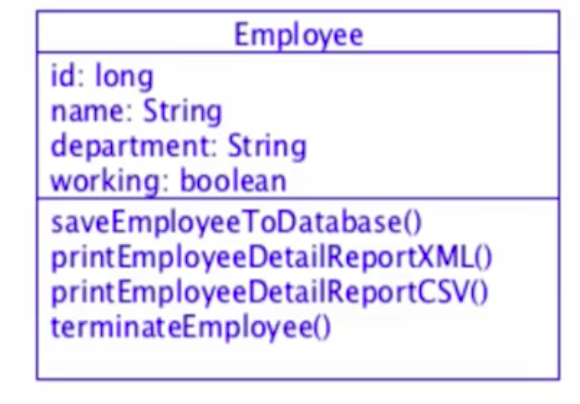

## What is SOLID design principle ? ##
S.O.L.I.D stands for:
S - Single-responsiblity principle
O - Open-closed principle
L - Liskov substitution principle
I - Interface segregation principle
D - Dependency Inversion Principle

## 1. Single-Responsibility Principle ##
Single responsibility principle states that each class must have only one responsibility. 

### 1.1 Class design without single responsibility principle ###

In this class design, we can see that Employee class is responsible for saveing employee to the database, printing report in XML and CSV and terminating an Employee. 
 

- If the employee database implementation changes then all classes containing database code must be modified including the listed class.

- Requirement changes inside XML and CSV requires changes inside Employee class.

Thus, this class is not following the single responsibility principle

### 1.2 Class design with single responsibility principle ###

