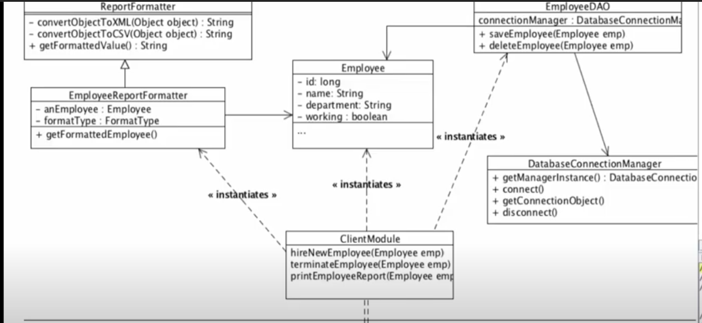

## 1. Single-Responsibility Principle ##
Single responsibility principle states that each class must have only one responsibility. 

### 1.1 Class design without single responsibility principle ###

In this class design, we can see that Employee class is responsible for saveing employee to the database, printing report in XML and CSV and terminating an Employee. 
<br/>

- If the employee database implementation changes then all classes containing database code must be modified including the listed class.

- Requirement changes inside XML and CSV requires changes inside Employee class.

Thus, this class is not following the single responsibility principle

### 1.2 Class design with single responsibility principle ###

- In this design DatabaseManager is responsible for managing connection
- EmployeeDao is responsible for save and delete
- EmployeeReportFormatter is responsible for formatting report
- Employee class is normal POJO


## Example 1 ##
### Example 1.1 code without good single responsibility principle ###
```java
public class Employee{
  private String employeeId;
  private String name;
  private string address; 
  private Date dateOfJoining;
  public boolean isPromotionDueThisYear(){
    //promotion logic implementation
  }
  public Double calcIncomeTaxForCurrentYear(){
    //income tax logic implementation
  }
  //Getters & Setters for all the private attributes
}
```

### Example 1.2 code with good single responsibility principle 

```java
public class HRPromotions{
  public boolean isPromotionDueThisYear(Employee emp){
    //promotion logic implementation using the employee information passed
  }
}
```

```java
public class FinITCalculations{
  public Double calcIncomeTaxForCurrentYear(Employee emp){
    //income tax logic implementation using the employee information passed
  }
}
```

```java
public class Employee{ 
  private String employeeId;
  private String name;
  private string address; 
  private Date dateOfJoining;
  //Getters & Setters for all the private attributes
}
```

## Example 2 ##
### Example 2.1 Code without good Single Responsibility Principle ###
let’s assume we have working on an application which involve working with employees. We have an interface IEmployeeStore and it’s implementation EmployeeStore which have following methods.
```java
IEmployeeStore.java
public interface IEmployeeStore 
{
    public Employee getEmployeeById(Long id);
     
    public void addEmployee(Employee employee);
     
    public void sendEmail(Employee employee, String content);
}
```

```java
EmployeeStore.java
public class EmployeeStore implements IEmployeeStore 
{
    @Override
    public Employee getEmployeeById(Long id) {
        return null;
    }
     
    @Override
    public void addEmployee(Employee employee) {
         
    }
 
    @Override
    public void sendEmail(Employee employee, String content) {      
    }
}
```
Above class seems good on any normal application. using EmployeeStore, are able to get/add employees and send email to them.

Now suppose after product release, we got requirement that email content can be of two types i.e. HTML and text. Above class supprt only text content. What you will do?

One way to solve this issue is create another method sendHtmlEmail() – but what happens when we are asked to support different protocols for sending emails for both content types. Overall class will look very ugly and difficult to read and maintain.

### Example 2.2 code with good single responsibility principle ###
```java
IEmployeeStore.java
public interface IEmployeeStore 
{   
    public Employee getEmployeeById(Long id);
     
    public void addEmployee(Employee employee);
}
```

```java
EmployeeStore.java
public class EmployeeStore implements IEmployeeStore 
{
    //inject in runtime
    private IEmailSender emailSender;
     
    @Override
    public Employee getEmployeeById(Long id) {
        return null;
    }
     
    @Override
    public void addEmployee(Employee employee) {
    }
}
```

```java
IEmailSender.java
public interface IEmailSender 
{
    public void sendEmail(Employee employee, IEmailContent content);
}
```

```java
EmailSender.java
public class EmailSender implements IEmailSender
{
    @Override
    public void sendEmail(Employee employee, IEmailContent content) {       
        //logic
    }
}
```

```java
IEmailContent.java
public interface IEmailContent {
     
}
```

```java
EmailContent.java
public class EmailContent implements IEmailContent 
{
    private String type;
    private String content;
}
```